# Exercise 01: How to Build a Blog using Gatsby and Host it on AWS with a CDN

In this exercise, you will learn how to create a blog using Gatsby, a popular static site generator that allows you to build fast websites with React. You'll also learn how to host your blog on Amazon Web Services (AWS) using a CDN (Content Delivery Network) to ensure that your content is delivered quickly and reliably to users around the world.

## Preperation

* Login to AWS Academy

Login URL: https://awsacademy.instructure.com/


Click on Student Login

* Enter Username


Email: Sxxxxxxxxxx@students.fh-hagenberg.at

Password: You have defined the password during the activation process of the account. It's not the FH SSO password!

* AWS Academy Console

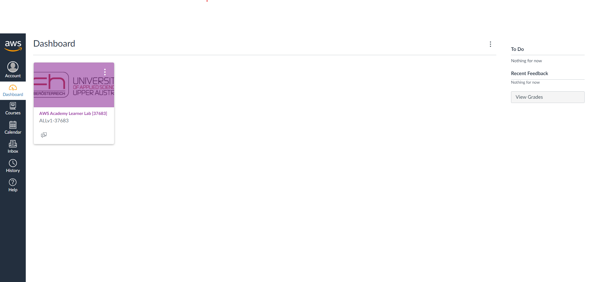

* Open the "AWS Academy Learner Lab and navigate to the "Learner Lab" Module

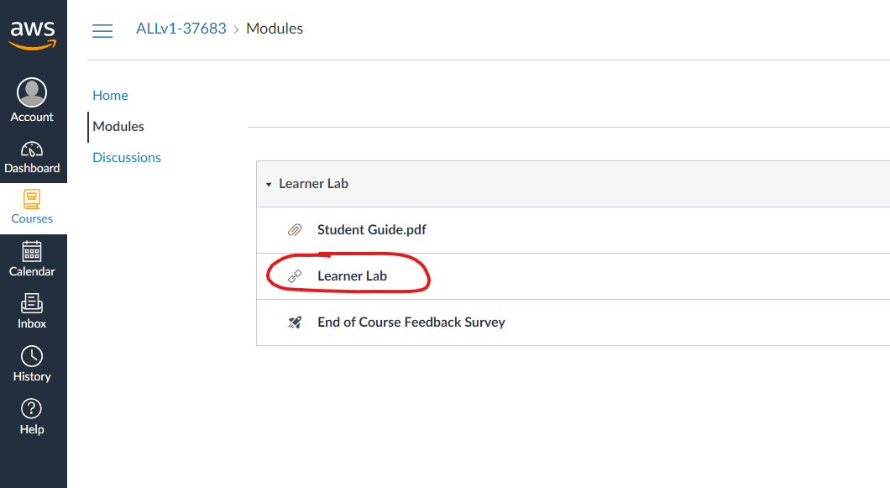

* Click on "Start Lab"

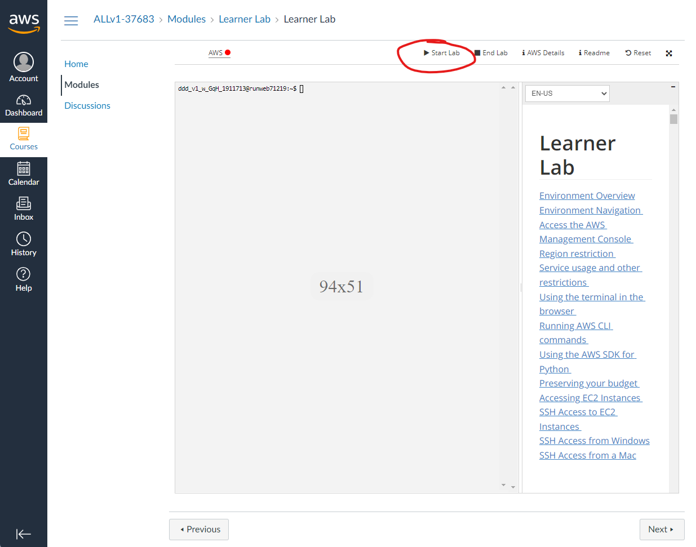

* Click on "AWS Details" and "Download URL"
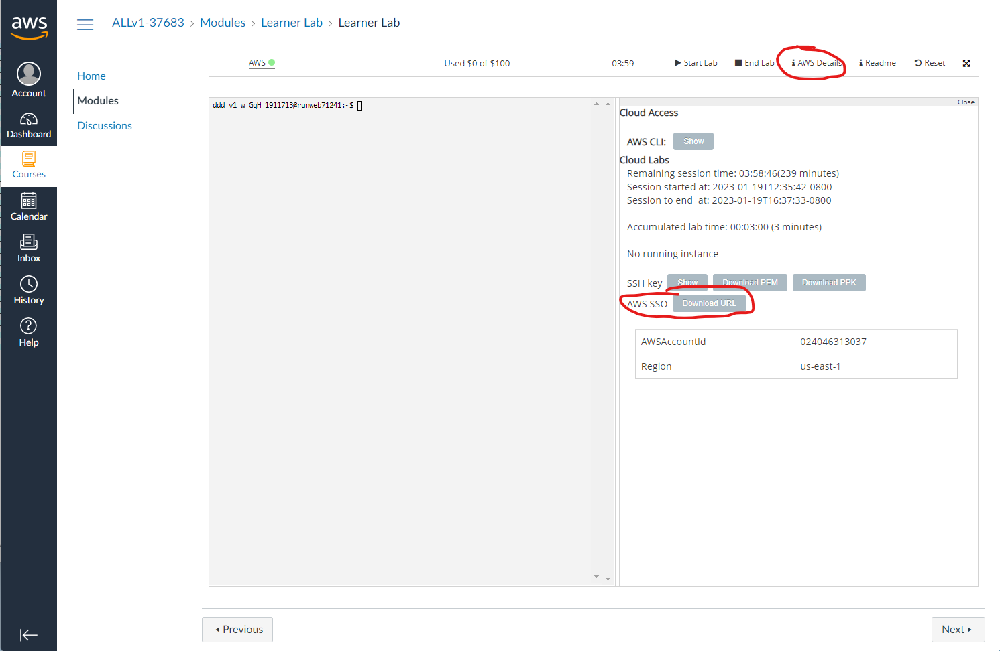

* Open downloaded text file and open the link in a new tab

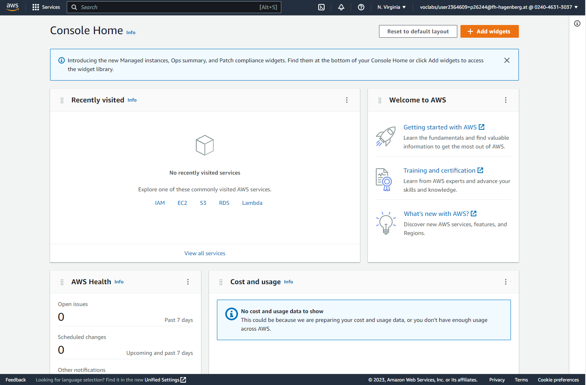

* Ready for the Exercise


## Exercise Part 01: Create Blog with Gatsby CLI


### Steps
* Install Gatsby CLI https://www.gatsbyjs.com/docs/reference/gatsby-cli/
* Initialize a new project from a starter project

```
npx gatsby new wak-blog https://github.com/gatsbyjs/gatsby-starter-blog
```

* Start the dev server and test the blog
```
npx gatsby develop
```

* Open the development version of the blog in the browser http://localhost:8000/ 

* In the next step, you can make various adjustments to the blog to get a better understanding of how Gatsby works

```
1.) Add a new blog post. The data of the blog can be found in teh content folder
2.) Change the current name of the blog from "Gatsby Starter Blog" to "WAK Blog"
3.) Change the blogger to yourself
```

* Creating a production version of the blog for hosting on a web server

```
npx gatsby build
```

The result of the build process is stored in the public folder. The content of this folder can be uploaded to any webserver


## Exercise Part 02: Host the Blog on AWS with S3 and CloudFront

In this part, you'll learn how to host your blog on Amazon Web Services (AWS) using S3 (Simple Storage Service) and CloudFront. In order to make the setup process of S3 and CloudFront more efficient and straightforward, we'll leverage the capabilities of AWS CloudFormation, an infrastructure-as-code tool that allows us to define and manage AWS resources using templates.

AWS CloudFormation is a service provided by Amazon Web Services (AWS) that allows you to model and provision cloud infrastructure resources using code. You can use CloudFormation to create, update, and delete AWS resources in a safe, repeatable, and automated way, without requiring manual intervention. CloudFormation uses templates, which are JSON or YAML files that describe the resources and their relationships, to define and configure the infrastructure. By using CloudFormation, you can improve your deployment speed, reduce your operational costs, and ensure consistency and reproducibility of your infrastructure.

* Open AWS Console and navigate to the CloudFormation Service
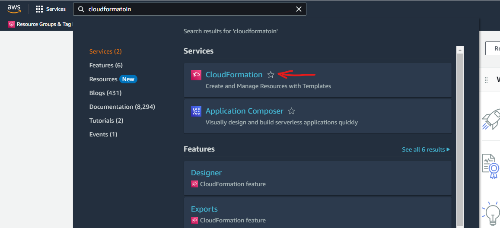

* Create a new Stack
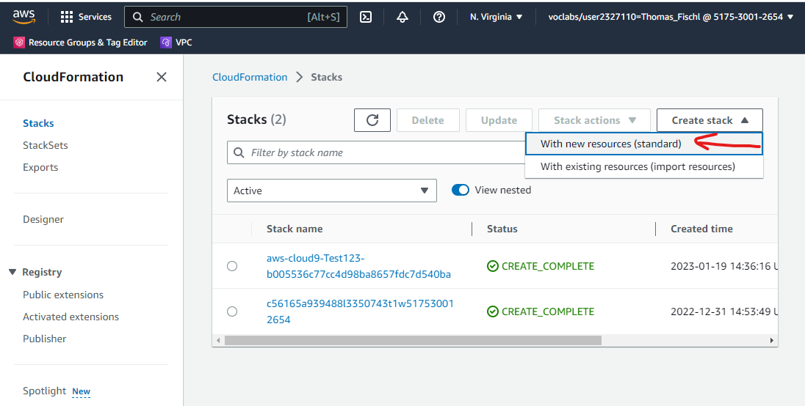

* Select "Upload a template file" and select the file "cfn-cdn.yaml". 
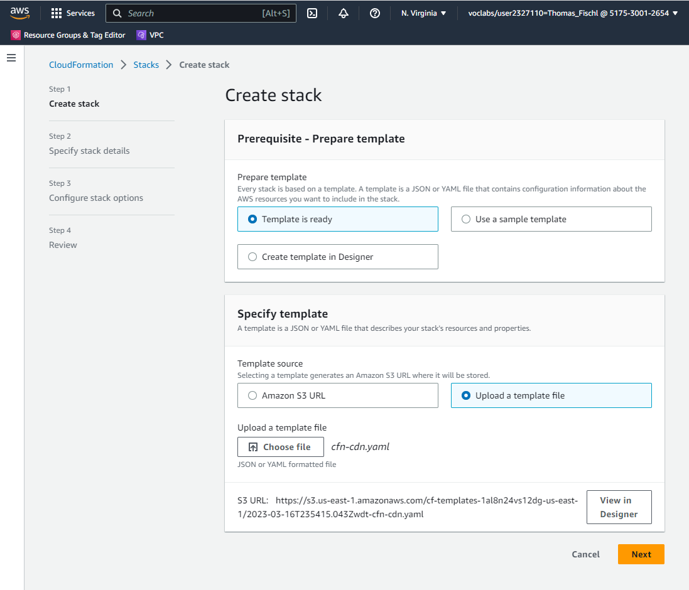

* Name the Stack "WAK-Blog"

* Continue the Wizard with default settings and click on "Submit"

* Wait, until the stack is created. 

* The next step is to upload the generated static resources from the public folder to S3. For this, we will use the AWS CLI. https://docs.aws.amazon.com/cli/latest/userguide/getting-started-install.html

* Configure the AWS CLI Credentials. Copy the credential information from the AWS Academy account to the file ~/.aws/credentials. 

https://docs.aws.amazon.com/cli/latest/userguide/cli-configure-files.html

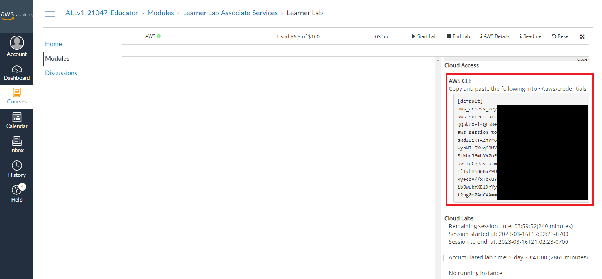

* Open the Output tab of the Stack and copy the upload command. 
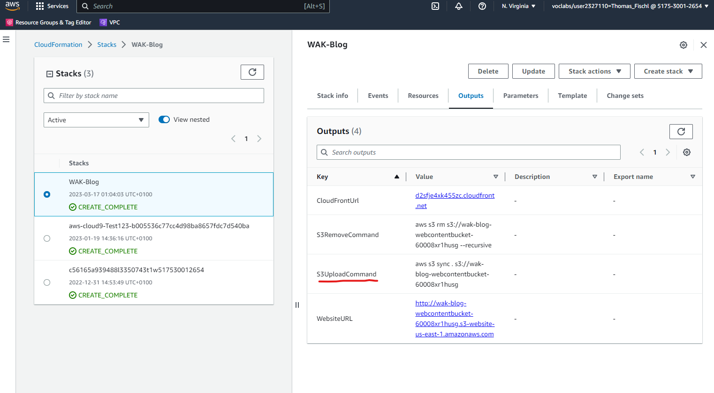

Before you execute the command, you need to naviate to the public folder of the blog

```
aws s3 sync . s3://wak-blog-webcontentbucket-xxxxxxxxxxxx
```

* Use the WebsiteUrl link from the Output tab to naviate to the S3 hosted website

Example: http://wak-blog-webcontentbucket-xxxxxxx.s3-website-us-east-1.amazonaws.com/

* The last step is to test the CloudFrontUrl from the Output tab. 

Example: http://d2sfje4xk455zc.cloudfront.net


## Exercise Part 03: Remove AWS Resoruces

* Remove all objects from the S3 bucket. The command can be also found on the Output page.
```
ws s3 rm s3://wak-blog-webcontentbucket-xxxxxxxxx --recursive
```

* Delete the CloudFormation stack

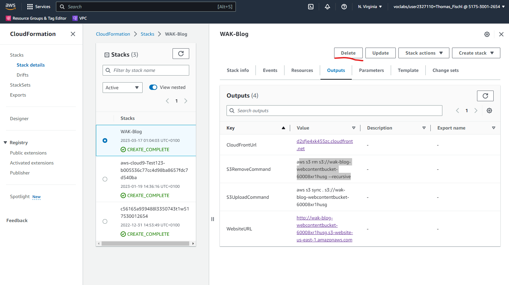


